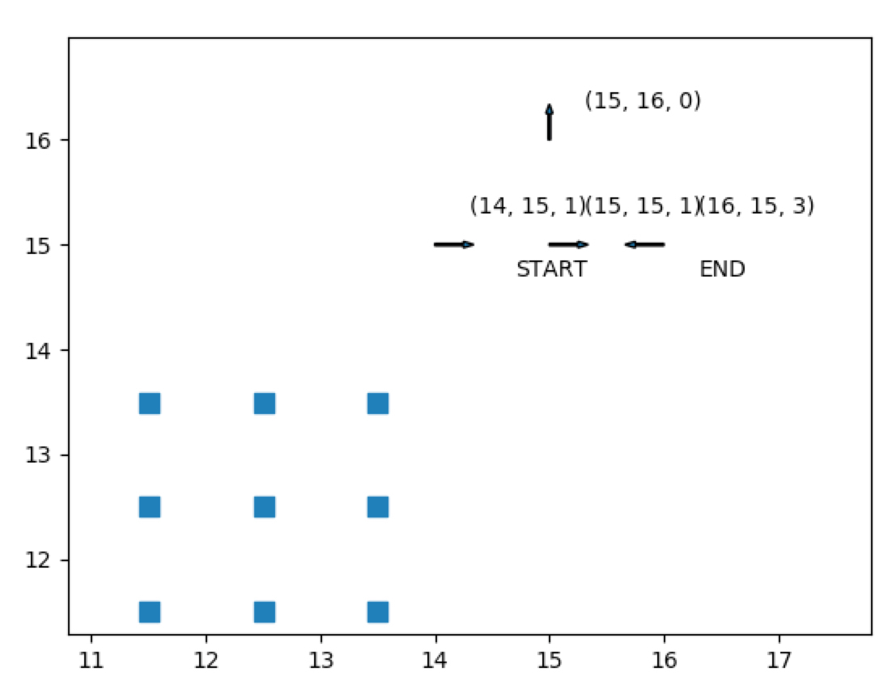

# nonholonomic_car_grid_search
Greedy BFS implemented for path search with no obstacles, and A* implemented for obstacles.

Allowable directions are 6 adjacent nodes due to the nonholonomic constraint of a car.
The orientation of the car at goal needs to be met for this planning to be complete.

!
!
!
!
!
!
